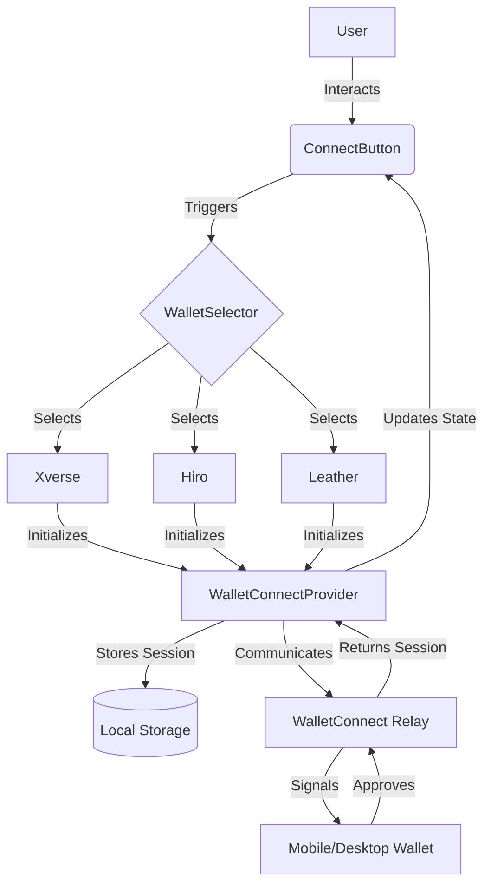

# WalletConnect Integration Guide

Comprehensive documentation for integrating WalletConnect into the PassportX ecosystem.

## Overview

WalletConnect is a decentralized protocol for connecting dApps to mobile wallets with QR code scanning or deep linking. In PassportX, WalletConnect is primarily used to:

-   Connect Stacks wallets (Xverse, Hiro, Leather)
-   Sign transactions securely without exposing private keys
-   Verify account ownership
-   Handle session persistence across browser refreshes

This guide provides everything you need to know to set up, use, and maintain the WalletConnect integration.

## Architecture

The integration follows a provider-consumer pattern using React Context for state management.



### Core Components

1.  **`WalletConnectProvider`**: Located in `src/contexts/WalletConnectContext.tsx`. It manages the lifecycle of the WalletConnect session, including initialization, connection, disconnection, and session restoration.
2.  **`ConnectButton`**: A reusable UI component that displays the connection status and triggers the connection modal.
3.  **`WalletSelector`**: A modal component that allows users to choose their preferred Stacks wallet or scan a QR code.
4.  **`WalletConnectAnalytics`**: Tracks connection success rates, common errors, and wallet popularity.

## Setup Guide

### 1. Prerequisites

Before you begin, ensure you have:
- A WalletConnect Project ID from the [WalletConnect Cloud](https://cloud.walletconnect.com/).
- Stacks wallets (Xverse, Hiro, or Leather) installed on your device or browser.

### 2. Environment Configuration

Add the following environment variables to your `.env.local` file:

```env
# Required: Your WalletConnect Project ID
NEXT_PUBLIC_WALLETCONNECT_PROJECT_ID=your_project_id_here

# Optional: Custom Relay URL (defaults to wss://relay.walletconnect.org)
NEXT_PUBLIC_WALLETCONNECT_RELAY_URL=wss://relay.walletconnect.org

# Optional: App metadata for WalletConnect modal
NEXT_PUBLIC_APP_NAME="PassportX"
NEXT_PUBLIC_APP_DESCRIPTION="Decentralized Identity on Stacks"
NEXT_PUBLIC_APP_URL="https://passportx.xyz"
NEXT_PUBLIC_APP_ICON="https://passportx.xyz/logo.png"
```

### 3. Installation

Ensure all required dependencies are installed:

```bash
npm install @reown/walletkit @walletconnect/core @walletconnect/utils qrcode
```

### 4. Provider Integration

Wrap your application with the `WalletConnectProvider` in `src/app/layout.tsx`:

```tsx
import { WalletConnectProvider } from '@/contexts/WalletConnectContext';

export default function RootLayout({ children }: { children: React.ReactNode }) {
  return (
    <html lang="en">
      <body>
        <WalletConnectProvider>
          {children}
        </WalletConnectProvider>
      </body>
    </html>
  );
}
```

## API Reference

### Frontend Context (`useWalletConnect`)

The `useWalletConnect` hook provides access to the connection state and methods.

| Property | Type | Description |
| :--- | :--- | :--- |
| `isConnected` | `boolean` | True if a wallet is currently connected. |
| `isConnecting` | `boolean` | True if a connection attempt is in progress. |
| `address` | `string \| null` | The connected Stacks address. |
| `walletType` | `string \| null` | The type of connected wallet (e.g., 'Xverse'). |
| `connect` | `() => Promise<void>` | Opens the connection modal. |
| `disconnect` | `() => Promise<void>` | Terminates the current session. |
| `signTransaction` | `(tx: any) => Promise<string>` | Requests the wallet to sign a transaction. |

### Backend/Internal Endpoints

| Endpoint | Method | Description |
| :--- | :--- | :--- |
| `/api/analytics/walletconnect` | `POST` | Records WalletConnect events (connect, disconnect, errors). |
| `/api/walletconnect/status` | `GET` | Health check for WalletConnect relay connectivity. |

#### Analytics Payload Example:

```json
{
  "event": "connect",
  "wallet": "Xverse",
  "address": "SP...",
  "timestamp": "2024-03-20T12:00:00Z"
}
```


